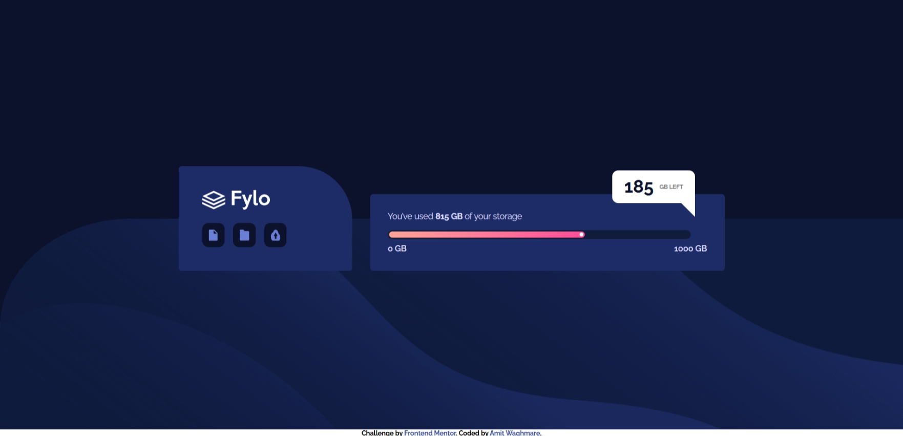
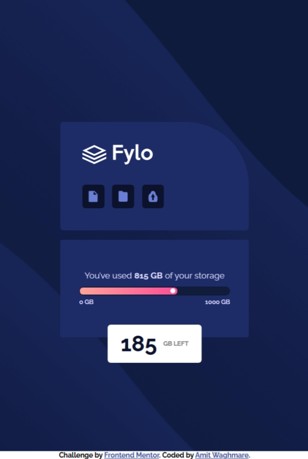

# Frontend Mentor - Fylo data storage component solution

This is a solution to the [Fylo data storage component challenge on Frontend Mentor](https://www.frontendmentor.io/challenges/fylo-data-storage-component-1dZPRbV5n). Frontend Mentor challenges help you improve your coding skills by building realistic projects. 

## Table of contents

- [Overview](#overview)
  - [The challenge](#the-challenge)
  - [Screenshot](#screenshot)
  - [Links](#links)
- [My process](#my-process)
  - [Built with](#built-with)
  - [What I learned](#what-i-learned)
- [Author](#author)

## Overview

### The challenge

Users should be able to:

- View the optimal layout for the site depending on their device's screen size

### Screenshot

### Links

- Solution URL: [Click here to view the Frontend Mentor solution](https://www.frontendmentor.io/solutions/responsive-landing-page-for-flyo-data-storage-g_qfoIM2Gs)
- Live Site URL: [Click here to view the live webpage](https://flyo-data-storage-umber.vercel.app/)

## My process

### Built with

- Semantic HTML5 markup
- CSS custom properties
- Flexbox
- CSS Grid
- Mobile-first workflow

### What I learned

This was a bit tough web page for me as a beginner, it consisted some basic use of HTML and CSS but some components like the floating box were asking for intermediate CSS skills (ofcourse I took help from Internet), now I learnt what things to use where like the position attribute and such things. Altough I will need to work on such projects more to get a hang of these things.

## Author

- Frontend Mentor - [@waghmare-amit](https://www.frontendmentor.io/profile/waghmare-amit)
- Twitter - [@waghmareamit24](https://www.twitter.com/waghmareamit24)
